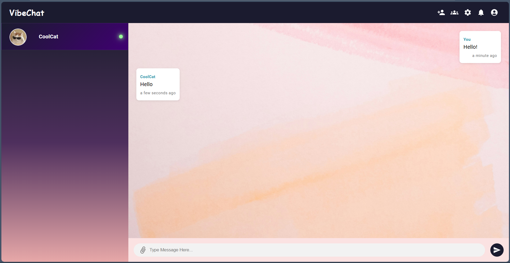

# VibeChat

**VibeChat** is a sleek, real-time chat application built for seamless communication. Whether you're messaging one-on-one or in groups, VibeChat makes connecting with others fast and intuitive.

## ✨ Features

- ⚡ Real-time messaging using WebSockets
- 🔐 Secure user authentication with JWT
- 💬 Private chat rooms
- 💾 Persistent message storage with MongoDB
- 📱 Responsive UI

## 🛠 Tech Stack

- **Frontend**: React, Material UI,Redux,Socket.IO Client
- **Backend**: Node.js, Express, Socket.IO
- **Database**: MongoDB + Mongoose
- **Authentication**: JWT (JSON Web Tokens)

## 🚀 Getting Started

### 1. Clone the Repository

```bash
git clone https://github.com/your-username/vibechat.git
cd vibechat
```

### 2. Install Dependencies

**Backend:**

```bash
cd server
npm install
```

**Frontend:**

```bash
cd ../client
npm install
```

### 3. Set Environment Variables

Create a `.env` file in the `server` folder:

```env
PORT=
MONGO_URI=
JWT_SECRET=
CLOUDINARY_CLOUD_NAME=
CLOUDINARY_API_KEY=
CLOUDINARY_API_SECRET=
```

### 4. Run the App

From the root directory:

```bash
npm run both
```

Or in separate terminals:

```bash
# Terminal 1
cd server
npm run dev

# Terminal 2
cd client
npm run dev
```

## 🌐 Live Demo

Check out the live version: [https://vibe-chat-xi.vercel.app](https://vibe-chat-xi.vercel.app)

## 📸 Screenshots



## 🤝 Contributing

Contributions are welcome! Feel free to fork the repository and submit a pull request. For major changes, please open an issue first to discuss what you’d like to change.
